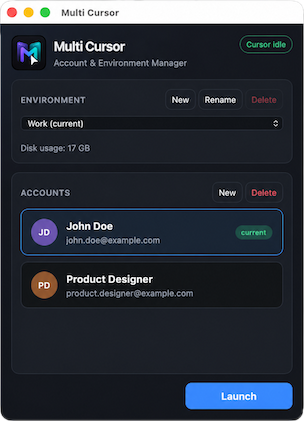
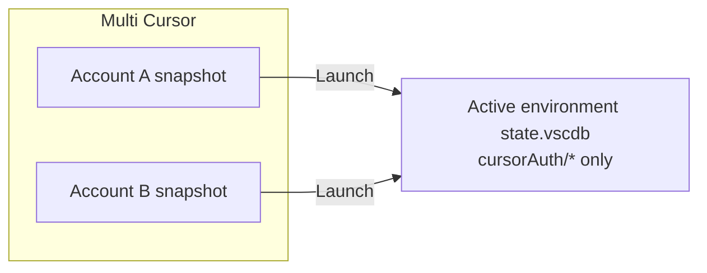
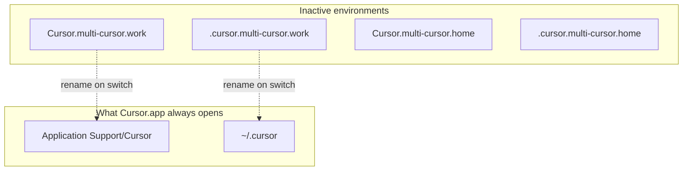

# Multi Cursor

<div style="width:838px">



*One Cursor installation. Multiple lives.*

Cursor currently supports one signed-in account per installation. If you move between work and personal accounts (or need fully independent Cursor setups) you would normally sign out and back in repeatedly, use launch scripts, or keep alternate data folders by hand.

**Multi Cursor** is a small macOS companion app that switches [Cursor](https://cursor.com) to the account and environment you choose. After switching, you just open Cursor as usual.

### Features

* Switch between multiple Cursor accounts
* Launch Cursor normally from the Dock, Spotlight, Finder, or Terminal
* No wrapper scripts or special launch commands
* Switch accounts without duplicating environment data, or
* Create fully isolated Cursor environments
* Fully open source and free to use

</div>
<br clear="right">

> Multi Cursor is an independent community project and is not affiliated with Cursor or Anysphere.


## The key idea

Most alternatives require a special way to launch Cursor every time. Multi Cursor does not. **Once you've selected an account or environment, that becomes your current Cursor setup.** Opening `/Applications/Cursor.app` works just as it always did, with the right history, settings, extensions, and login already in place.

Multi Cursor is not a wrapper around Cursor. It is a companion app that prepares Cursor's normal data folders, then opens Cursor normally.

## Two levels of isolation

|                  | Best for                                                 | What changes                                                                                         |
| ---------------- | -------------------------------------------------------- | ---------------------------------------------------------------------------------------------------- |
| **Accounts**     | Several work or team logins within the same Cursor setup | The identity and subscription change. Chat history, settings, windows, and extensions remain shared. |
| **Environments** | Work vs personal, or any completely separate context     | Each environment has its own chat history, open windows, settings, extensions, and accounts.         |

Use an **account** when you want another Cursor login without changing your setup. Use an **environment** when you want an entirely separate Cursor life.

On first launch, Multi Cursor adopts your existing Cursor data as the **Default** environment and detects any existing signed-in account.

## Multi Cursor vs other approaches

| Approach                  | Multiple logins?               | Separate history and extensions? | Open Cursor normally? | Catch                                              |
| ------------------------- | ------------------------------ | -------------------------------- | --------------------- | -------------------------------------------------- |
| Sign out / sign in        | Yes                            | No                               | Yes                   | Slow and easy to mix contexts                      |
| Cursor / VS Code profiles | No, one login per installation | Partial                          | Yes                   | Profiles are UI/tooling presets, not subscriptions |
| `--user-data-dir`         | Yes, with separate folders     | Yes                              | No                    | You must use a special launch command              |
| **Multi Cursor**          | **Yes**                        | **Environments, when needed**    | **Yes**               | Cursor briefly quits while switching               |

## Getting Multi Cursor

Multi Cursor is fully open source and currently distributed source-first: build it locally using the instructions below. This keeps the project transparent and avoids asking anyone to trust an unsigned binary from the internet.

Maintaining signed, notarized macOS releases requires an Apple Developer membership and ongoing release management. I originally built Multi Cursor for my own workflow and published it because it may help others; for now, I’ve chosen to keep the project source-first rather than investing time and money into maintaining official binaries. That may change if there is enough demand.

Building a local copy typically takes only a few minutes.

> Note that a locally built app is suitable for your own Mac; distributing it to other people requires proper Apple signing and notarization.
> For signing, notarization, and distributing a build, see [macOS distribution](docs/macos-distribution.md).

## Platform support

Multi Cursor is compatible with macOS 11 or later.

### What about Windows and Linux?

Windows and Linux are not supported yet.

Contributions are welcome; see [Contributing](CONTRIBUTING.md).

## Requirements

- macOS 11 or later
- [Node.js](https://nodejs.org/) 20 or later
- [Rust](https://rustup.rs/) (`rustup` / `cargo`)
- Xcode Command Line Tools: `xcode-select --install`
- Cursor installed at `/Applications/Cursor.app` (configurable with `cursorAppPath` in `~/.multi-cursor/config.json`)

## Install

### Develop

```bash
npm install
npm run tauri dev
```

### Build and install

Build a release app:

```bash
npm run tauri build
```

The build output is `src-tauri/target/release/bundle/macos/Multi Cursor.app`. Consider it a build artifact; you'll want to install and use a copy in `~/Applications` instead, so run:

```bash
npm run install-app
```

This copies the existing release build to `~/Applications/Multi Cursor.app`, removes stale local build artifacts that can confuse Spotlight, and registers the installed app. It does not rebuild.

**To build and install in one step:**

```bash
npm run install-app -- --build
```

Open it from Spotlight or Launchpad, or run:

```bash
open ~/Applications/Multi\ Cursor.app
```

If Multi Cursor is open, quit it before updating. If Spotlight shows an older duplicate, run `npm run install-app` again and avoid opening the copy under `src-tauri/target/`.

### Optional local signing

**Ad-hoc signing is optional for your own Mac.** If your local build opens without a Gatekeeper warning, you do not need it.

If you actually need it, run:

```bash
codesign --force --deep --sign - "$HOME/Applications/Multi Cursor.app"
xattr -dr com.apple.quarantine "$HOME/Applications/Multi Cursor.app"
```

**Warning:** This does not make the app suitable for distribution to other Macs.

## Using Multi Cursor

### First-time setup

1. Start Multi Cursor from the installed app or with `npm run tauri dev`.
2. Your existing Cursor data appears as the **Default** environment. Rename it if useful. If Cursor was signed in, the account email appears automatically.
3. Optionally select **New** under Environment.
4. **Copy current environment** is enabled by default; turn it off for a completely empty environment with no settings, extensions, or chat history.
5. To add a login to the selected environment, choose **New** under Accounts.
6. If Cursor is open, confirm **Restart**. Cursor opens signed out in that environment; sign in normally.
7. Keep Multi Cursor open while sign-in finishes so it can automatically capture the account email.

### Day to day

1. Choose an environment. The current one is labelled.
2. Select an account. The current account has a **current** badge; a pending login has a temporary **Signing in…** label.
3. Click **Launch**, or double-click the account.
4. After switching, next time you open Cursor, it will be in the selected environment and account. You can continue to use Cursor normally from the Dock, Spotlight, Finder, or `/Applications/Cursor.app` until you need to switch again.

When switching, Multi Cursor closes Cursor if necessary, activates the selected data and login, then reopens Cursor. **Launch** is disabled when Cursor is already running with the selected account and environment.

### Managing environments and accounts

- **Rename environment** changes only its display name, never its folder identifier.
- **Delete environment** is available only for inactive environments. Its stored folders and account snapshots move to Trash.
- **Delete account** removes Multi Cursor's saved login snapshot. Cursor only needs to quit when deleting the current account.
- Account names are captured email addresses, so they cannot be renamed. A temporary label is used while sign-in is pending.

### Tips

- Creating new environments may consume several gigabytes of disk space, depending on your existing Cursor installation, installed extensions, and accumulated data.
- If a flow needs to quit Cursor, do not run Multi Cursor from a `tauri dev` session inside Cursor, because quitting Cursor would end that session too.
- Copying an environment requires Cursor to quit because its data files may be locked.
- **Cursor running** and **Cursor idle** report whether the Cursor IDE process is open.
- Auth files under `~/.multi-cursor/accounts/` contain tokens. Never commit or share them.

## How it works

Multi Cursor does not require flags or a launcher script. It makes Cursor's normal data folders match the selection, then starts Cursor as any other Mac app would.

### Accounts: lightweight switching

Each account is a snapshot of Cursor's `cursorAuth/*` login keys in `~/.multi-cursor/accounts/`. Switching writes those keys into the active environment's `state.vscdb`; it does not duplicate the whole database, which can be many GB.



Within one environment, history, settings, and extensions stay the same; only the signed-in identity changes.

### Environments: full separation

Cursor always reads these locations:

- `~/Library/Application Support/Cursor`
- `~/.cursor`

Inactive environments live alongside them as `Cursor.multi-cursor.<id>` and `.cursor.multi-cursor.<id>`. On a switch, Multi Cursor renames the chosen folders into Cursor's normal paths. Cursor must be closed first, but the normal paths are why everyday Dock and Spotlight launches still work.



It provides the isolation people seek from `--user-data-dir`, while retaining the ordinary Cursor launch workflow.

**Data layout** (click to expand)

```
~/Library/Application Support/
  Cursor                              # current environment
  Cursor.multi-cursor.<env-id>/       # inactive environments

~/.cursor                             # current environment extensions / CLI state
~/.cursor.multi-cursor.<env-id>/      # inactive environments

~/.multi-cursor/
  config.json
  .storage-v2                         # internal migration metadata
  accounts/<env-id>/<account-id>.json # cursorAuth/* snapshots
```

## Safety

- Folder renames and authentication-database writes happen only after Cursor has quit.
- Account snapshots contain only `cursorAuth/*` keys; Multi Cursor never copies the complete `state.vscdb` on every switch.
- Environment copies skip caches and `state.vscdb.bak-*` files. Leftover live-profile backups are cleaned up on startup to reclaim disk space.
- Deleting an inactive environment moves its pool folders to Trash. Multi Cursor never deletes the live `Cursor` or `~/.cursor` folders.

## FAQ

### Why not use Cursor Profiles?

Profiles separate editor preferences and extensions, but Cursor still has one signed-in account per installation. Multi Cursor accounts solve that login limitation; environments add complete data separation when needed.

### Why not use `--user-data-dir`?

It is a valid way to isolate data, but every launch must use the right command. Multi Cursor activates the selected environment in Cursor's default locations, so Dock and Spotlight launches keep working.

### Does it duplicate all my Cursor data when I switch accounts?

No. Account switching saves and restores only Cursor authentication keys. Creating a separate environment can copy the current environment, because that is deliberately a complete, independent setup.

### Can I lose my Cursor settings or data?

Switching is designed to use renames rather than destructive replacement, and deleted inactive environments go to Trash. As with any tool that manages application data, keep normal backups of important work.

### Why is this not a Cursor extension?

Multi Cursor needs to perform operations on Cursor's data folders that are not possible from within Cursor itself. For example, it needs to rename the data folders when switching environments, and it needs to write the authentication keys to the active environment's database.

### Will you publish signed releases?

Maybe. At the moment the project is intentionally source-first. If enough people use it, I’ll reconsider publishing notarized macOS releases.

## Author

Created by [Cláudio Silva](https://github.com/claudio-silva).

## License

Multi Cursor is licensed under the [Apache License 2.0](LICENSE.md).
